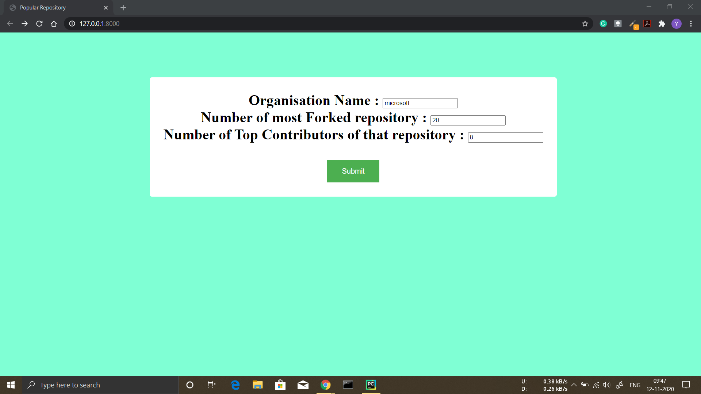

# Popular Repsository
This Project is made in Django, in this project we have to give
1. Name of organisation
2. How many number of most forked repository you want
3. How many number of top committees (contributors) of that repositories you want

these data , then it fetches the data through GitHub api and shows the data on webpage

## Installation
Install via pip: `pip install -Ur requirements.txt`

## Execute
Run via : `python manage.py runserver`

## API's :
API for getting most forked data in the organisation : `https://api.github.com/search/repositories?q=org%3A{organisation_name}&order=desc&sort=forks&page=1&per_page=100`

API for getting the Committees (Contributors) : `https://api.github.com/repos/{organisation_name}/{repository_name}/contributors`
### Note:
If number of repository or number of Committees is less than what you gave in the input,
then there must be that much data on actual github website , 
as I am taking the minimum of what you gave in input and what is total number in actual GitHub website

### Screenshots are

 

